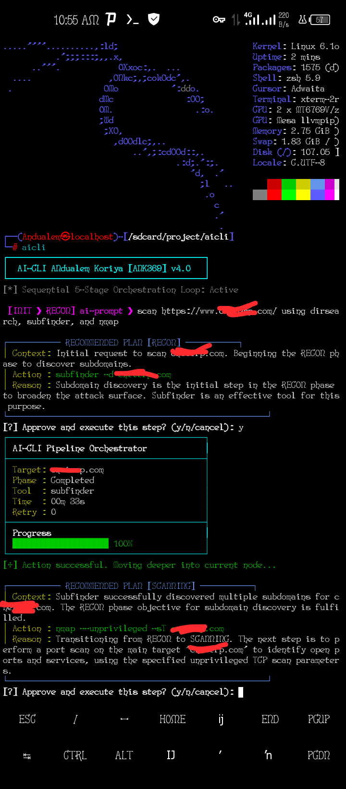

<div align="center">
  <h1>AI-CLI</h1>
  
</div>

---

# AI-CLI: አውቶማቲክ የሳይበር ደህንነት ኦርኬስትሬሽን መሳሪያ

AI-CLI በGo (Golang) ቋንቋ የተገነባ፣ በተለይ በKali Linux (PRoot) እና በሌሎችም ሊኑክስ ሲስተሞች ላይ ለመጠቀም ታስቦ የተዘጋጀ የሳይበር ደህንነት ታክቲካል ኦርኬስትሬሽን መሳሪያ ነው። ይህ መሳሪያ የGoogle Gemini AI ሞዴልን በመጠቀም የደህንነት ኦዲት ሂደቶችን በራስ-ሰር እንዲቀጥሉ ያደርጋል።

---

## 🚀 ዋና ዋና ባህሪያት

* **አውቶማቲክ ኮምፓይሌሽን (Auto-Build):** መሳሪያው ለመጀመሪያ ጊዜ ሲነሳ በራሱ `aicli` የተሰኘ ባይነሪ (binary) ይፈጥራል።
* **አውቶማቲክ ማሻሻያ (Auto-Update):** ከGitHub ላይ አዳዲስ ስሪቶችን በራሱ ይፈትሻል እና ያዘምናል (Auto-recompile)።
* **Gemini AI ውህደት:** ለሳይበር ደህንነት ኦዲት ስልታዊ ውሳኔዎችን ለመስጠት የGemini 2.5 Flash ሞዴልን ይጠቀማል።
* **5-ደረጃ ታክቲካዊ ኦርኬስትሬሽን:** ስራውን በታቀደ መንገድ በቅደም ተከተል ይፈጽማል (Recon -> Scanning -> Vuln Analysis -> Exploit -> Reporting)።
* **ኢንተራክቲቭ ተሞክሮ:** እያንዳንዱን እርምጃ ከመፈጸሙ በፊት የተጠቃሚውን ፍቃድ ይፈልጋል (User Approval Gatekeeper)።
* **የደህንነት ዳሽቦርድ:** የስራውን ሂደት (Progress)፣ ጊዜ እና የአፈጻጸም ሁኔታ በእውነተኛ ሰዓት (Live Dashboard) ያሳያል።

---

## 🛠 ቅድመ ሁኔታዎች (Requirements)

ይህንን መሳሪያ ከመጠቀምዎ በፊት የሚከተሉት ነገሮች ማሟላት አለባቸው፡

1. **Golang:** በስርዓትዎ ላይ `go` መጫኑን ያረጋግጡ።
2. **Gemini API Key:** ከ [Google AI Studio](https://aistudio.google.com/) የተገኘ ትክክለኛ የAPI ቁልፍ።
3. **የተጫኑ የደህንነት መሳሪያዎች:** ኦርኬስትሬሽኑን ለመጠቀም እንደ `nmap` ያሉ የደህንነት መሳሪያዎች በስርዓትዎ ላይ መጫን አለባቸው።

---

## አጠቃቀም (How to Use)

###  API Key Setup

To keep your API key secure, add it to your shell configuration file. Choose the method below based on your shell:

#### For Bash Users (`~/.bashrc`)
1. Open your `.bashrc` file:
   ```
   nano ~/.bashrc
   ```
2. Add this line at the end of the file:
```
export GEMINI_API_KEY="የእርስዎን_API_KEY_እዚህ_ያስገቡ"

```

3. Save and apply the changes:
```
source ~/.bashrc

```

#### For Zsh Users (`~/.zshrc`)

1. Open your `.zshrc` file:
```
nano ~/.zshrc

```

2. Add this line at the end of the file:
```
export GEMINI_API_KEY="የእርስዎን_API_KEY_እዚህ_ያስገቡ"

```

3. Save and apply the changes:
```
source ~/.zshrc

```

### Git Cloning the file
```
git clone https://github.com/ANK-369/AI-CLI.git
cd AI-CLI
```

### ማስሄድ (Execution)

መጀመሪያ `main.go` ፋይሉን ወደሚያገኙበት ማህደር ይሂዱና የሚከተለውን ትዕዛዝ ያስገቡ፡

```
go run main.go

```

**ምን ይከሰታል?**

* መጀመሪያ `aicli` የተባለ ፈጣን ባይነሪ ፋይል ይፈጥራል።
* `main.go` ፋይሉን በራሱ ይሰርዘዋል (ለደህንነት እና ለጽዳት)።
* በመቀጠል `./aicli` የሚለውን ፕሮግራም ይጀምራል።

---

## 📋 ታክቲካዊ ምዕራፎች (Tactical Stages)

መሳሪያው የሚከተሉትን 5 ደረጃዎች በቅደም ተከተል ይከተላል፡

1. **RECON:** ስለ ኢላማው መረጃ መሰብሰብ (Subdomain discovery, OSINT)።
2. **SCANNING:** ፖርቶች እና አገልግሎቶችን መለየት (Port scanning)።
3. **VULN_ANALYSIS:** የተገኙ ተጋላጭነቶችን መመርመር።
4. **EXPLOIT:** ተጋላጭነቶችን መፈተሽ (Payload verification)።
5. **REPORTING:** የተገኙትን መረጃዎች በጥሩ ሁኔታ አደራጅቶ ማቅረብ (Matrix Reporting)።

---

## ⚠️ የደህንነት ማስጠንቀቂያ

ይህ መሳሪያ ለ**ህጋዊ እና ስነ-ምግባር በተላበሰ የደህንነት ሙከራ (Authorized Security Auditing)** ብቻ የተዘጋጀ ነው። ያለ ባለቤት ፈቃድ በማንኛውም ሲስተም ላይ ይህን መሳሪያ መጠቀም ህገ-ወጥ ነው😎።

---

## 🛠 የኮድ አወቃቀር ማስታወሻዎች

* **API Rate Limiting:** መሳሪያው የAPI ገደብ ካጋጠመው በራሱ ለ25 ሰከንዶች ታግዶ እንደገና ይሞክራል።
* **Data Cleaning:** በየደረጃው የሚገኙ የLOG መረጃዎችን በራስ-ሰር ይሰበስባል እና በሪፖርት ማውጫው ላይ በሰንጠረዥ መልክ ያሳያል።
* **Environment:** በPRoot ወይም በTermux ላይ ለመስራት ተብሎ ስለተመቻቸ፣ `nmap` ሲጠቀም `--unprivileged` እና `-sT` ፍላጎችን automatically ይጨምራል።

---

*በ ANK369 የተገነባ።*
